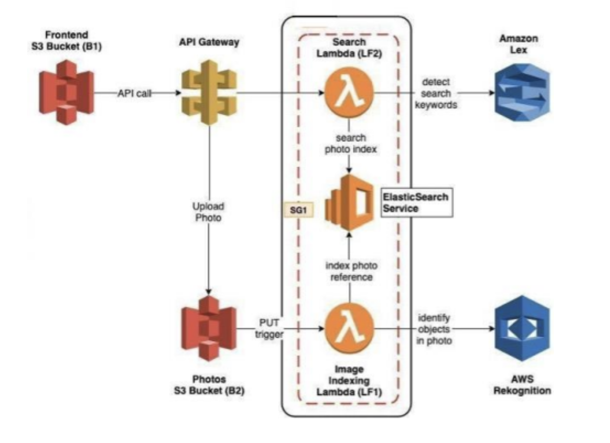

# LexiLens

LexiLens is a cloud-based photo album application that allows users to search for images using keywords associated with objects present in the photos, such as "birds," "trees," "dogs," etc. This project was developed for a cloud computing class, leveraging AWS services for image recognition, storage, and search.

---

## Features

- **Photo Upload**: Users can upload photos to the application via a simple Flask-based frontend.
- **Search by Keyword**: Photos can be searched using object tags automatically generated by AWS Rekognition.
- **Dynamic Tagging**: Uploaded images are processed to extract tags, enabling efficient and intuitive searches.
- **Automated Deployment**: Utilizes AWS CodeDeploy and a deployment pipeline for streamlined updates.
- **Infrastructure as Code**: AWS CloudFormation templates are used to automate the provisioning of AWS resources.

---

## System Architecture

### **Frontend**
- A Flask application provides a user-friendly interface for uploading photos and searching for images using keywords.

### **Search Flow**
1. Users enter a search keyword in the Flask application.
2. Flask calls the AWS API Gateway.
3. API Gateway invokes a Lambda function, which:
   - Calls the AWS Lex instance to interpret the keyword(s).
   - Queries OpenSearch for matching images based on tags.
4. Matching images are displayed back to the user.

### **Photo Upload Flow**
1. Users upload photos via the Flask application.
2. The uploaded images are stored in an AWS S3 bucket.
3. A Lambda function processes the image:
   - Runs it through AWS Rekognition to generate tags.
   - Stores the image and its tags in OpenSearch for later retrieval.

### **Deployment Pipeline**
- CodeDeploy manages the deployment of updates to the Flask application and Lambda functions.
- The pipeline ensures seamless updates to the application, reducing downtime and manual intervention.

---

## Infrastructure as Code with AWS CloudFormation

CloudFormation is used to provision and manage the required AWS resources. This ensures consistent and repeatable infrastructure setup. Key resources provisioned via CloudFormation include:

1. **S3 Bucket**: For storing uploaded photos.
2. **API Gateway**: To handle API requests between the frontend and backend.
3. **Lambda Functions**: For processing uploads and handling search queries.
4. **Rekognition and Lex Configurations**: To analyze images and interpret search queries.
5. **OpenSearch Instance**: To index and query tagged images.
6. **IAM Roles**: To ensure secure access and permissions for all services.

CloudFormation templates simplify resource management, enabling updates and rollbacks as needed.

---

## Technologies Used

- **Flask**: For the frontend interface.
- **AWS S3**: For storing uploaded images.
- **AWS Rekognition**: To analyze images and generate object tags.
- **AWS Lambda**: For serverless processing of uploaded photos and search queries.
- **AWS API Gateway**: To manage API calls between the Flask frontend and backend Lambda functions.
- **AWS Lex**: To interpret user search keywords.
- **AWS OpenSearch**: For indexing and querying images with their associated tags.
- **AWS CodeDeploy**: To automate application and Lambda function updates.
- **AWS CloudFormation**: For provisioning and managing infrastructure as code.

---

## Installation and Usage

### Prerequisites
- AWS account with the required services set up (S3, Rekognition, Lambda, API Gateway, Lex, OpenSearch, CodeDeploy).
- Python installed locally along with Flask and necessary dependencies.